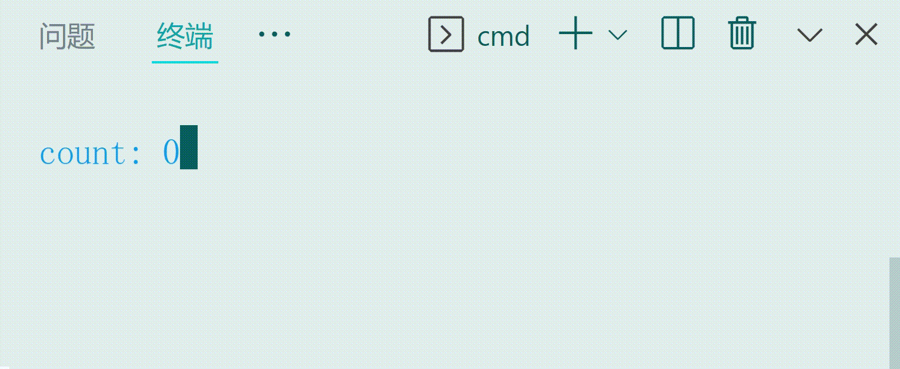

## Hades
将 Vue3.0 渲染到命令行

[`Ink`](https://github.com/vadimdemedes/ink) 的 Vue 实现版本

### 用法

```ts
import { createHadesApp } from 'hades';
import Counter from './counter.vue';

createHadesApp(Counter).mount();
```

```html
<script lang="ts" setup>
import { onMounted, onUnmounted, ref } from "vue";

const count = ref(0);

onMounted(() => {
    const timer = setInterval(() => {
        count.value++
    }, 1000)

    onUnmounted(() =>
        clearTimeout(timer)
    )
})

</script>;

<template>
    <h-view :style="{ color: 'blue' }">count: {{ count }}</h-view>
</template>;
```

